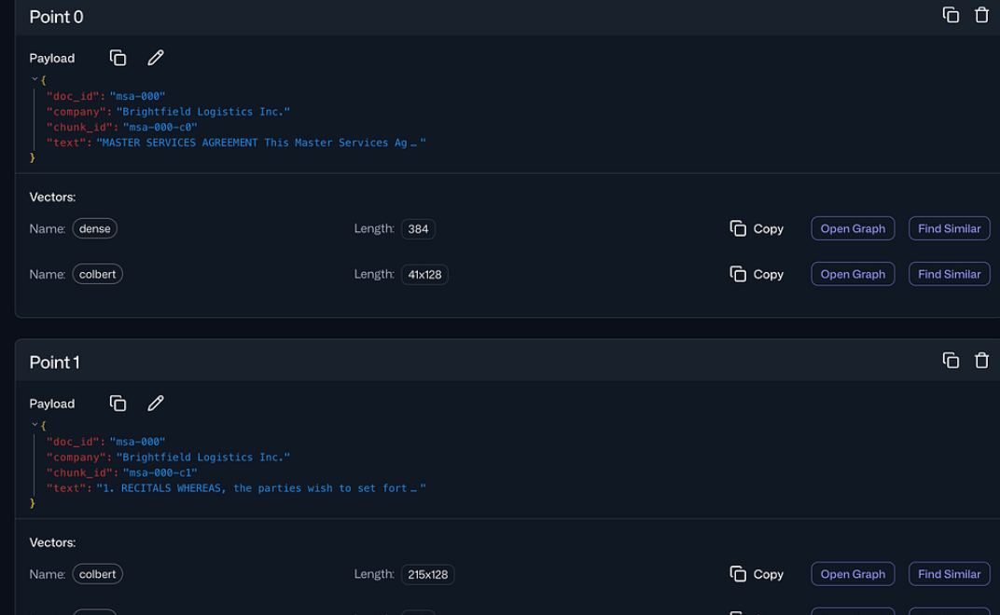
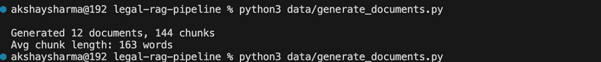
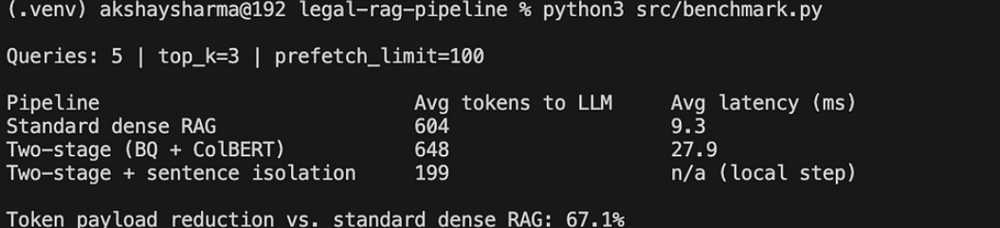
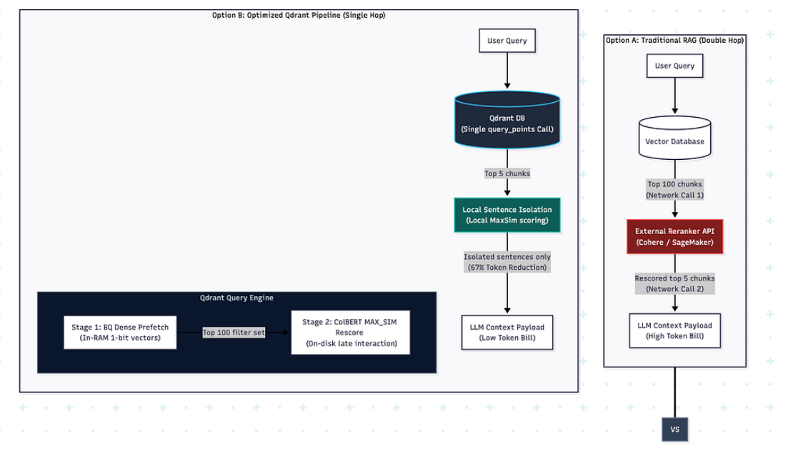

# Optimizing RAG Token Costs in Legal Discovery

This repository contains the codebase for a highly optimized, two-stage legal discovery pipeline built using **Qdrant** and **FastEmbed**.

It implements:
1. **Stage 1 (Prefetch):** Fast candidate retrieval using compressed 1-bit **Binary Quantized** dense vectors.
2. **Stage 2 (Rescore):** Precise token-level late interaction using **ColBERT MAX_SIM** comparison natively in Qdrant.
3. **Local Sentence Isolation:** Extracts and forwards only the specific sentence(s) driving the match to the LLM context, reducing token costs by **67%**.

## Directory Structure

* `src/`:
  * `collection.py`: Setup script for the Qdrant collection schemas and index configs.
  * `ingest.py`: Script to generate dual-embeddings and upsert documents.
  * `query.py`: Script to execute the unified two-stage query using Qdrant's universal Query API.
  * `isolate.py`: Logic to isolate matching sentences locally using ColBERT MAX_SIM.
  * `benchmark.py`: Comparative audit comparing token counts and latencies.
  * `sweep.py`: Prefetch limit sweep illustrating speed/accuracy recovery trade-offs.
  * `footprint_and_cost.py`: Calculates RAM savings (32x) and dollar-cost projections.
* `data/`:
  * `generate_documents.py`: Script to synthesize mock litigation files and contract clauses.

## Setup & Execution

1. Create and activate a virtual environment:
   ```bash
   python3 -m venv .venv
   source .venv/bin/activate
   ```
2. Install dependencies:
   ```bash
   pip install -r requirements.txt
   ```
3. Start Qdrant locally (required before ingestion):
   ```bash
   docker run -p 6333:6333 -p 6334:6334 -v "$(pwd)/qdrant_storage:/qdrant/storage" qdrant/qdrant
   ```
   If you prefer to run it in the background, add `-d` and a container name, for example:
   ```bash
   docker run -d --name qdrant -p 6333:6333 -p 6334:6334 -v "$(pwd)/qdrant_storage:/qdrant/storage" qdrant/qdrant
   ```
4. Generate the synthetic legal documents and chunk data:
   ```bash
   python3 data/generate_documents.py
   ```
   Running this command creates the dataset files used by the pipeline, including the generated chunk data in `data/chunks.json`. Those files are what the ingest step reads next.
5. Ingest documents:
   ```bash
   python3 src/ingest.py
   ```
6. Run benchmarks:
   ```bash
   python3 src/benchmark.py
   ```

## Screenshots

These images help illustrate the workflow and the results of the pipeline:

-  — Qdrant running locally after Docker startup
-  — The generated legal documents and chunk data produced by the generation script
-  — High-level architecture of the two-stage retrieval pipeline
-  — Example benchmark or query output showing the retrieval flow
